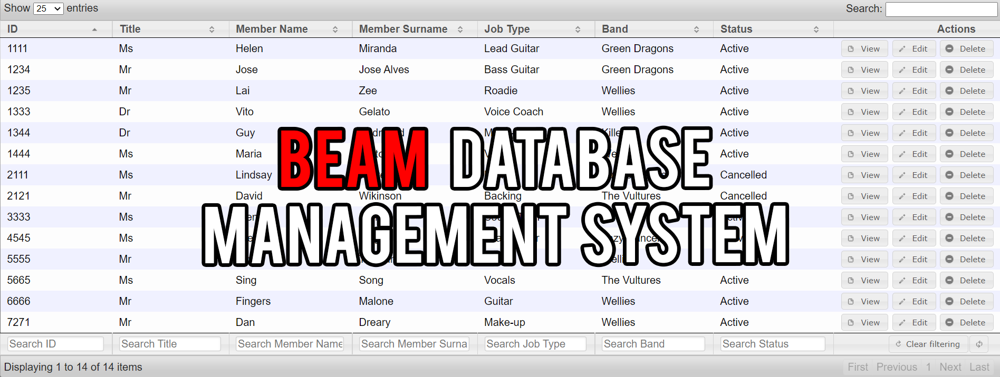

<!-- ABOUT THE PROJECT -->
## BEAM Database

BEAM is a monitoring and access management system designed for a music festival.

If you would like more information on the project, check out my [blog post](https://erolgelbul.com/project-blog/beam).

<!-- TECH STACK -->
## Tech Stack

I used the WAMP stack to develop this project.

* Windows: operating system the stack is designed for.
* Apache: local web server.
* MySQL: RDBMS (relational database maangement system).
* PHP: scripting language.

PHP-driven framework: [CodeIgniter](https://codeigniter.com/)

Library: [GroceryCRUD](https://www.grocerycrud.com/)

<!-- SETTING UP-->
## Setting up

1. Download [EasyPHP](https://www.easyphp.org/download.php).
2. Download [MySQLWorkbench](https://www.mysql.com/products/workbench/)

Adding the Files:

Note: if you do not want to go through this process, you may download the whole project folder [here](https://drive.google.com/drive/folders/135neGBZI4K0YRZd1GTQ32AlHso64hbRT?usp=sharing). (329 MB)

1. Download the project files.
2. Open the EasyPHP folder.
3. In the `localweb` folder, put all the `beam data` files.
4. In the `mysql` fodlerm put all the `beam mysql` files.
5. Run EasyPHP
6. Press F7, or right-click and choose `Local Web`.
7. Press on the folder icon that is right next to `beam`.

SQL Design in Workbench:

1. After downloading Workbench.
2. Run the file: `wrokbench.mwb.bak`

<!-- CONTRIBUTING -->
## Contributing

If you would like to add any extra features to the optimisation simulation, feel free to fork and create a pull request. Thank you!

1. Fork the Project
2. Create your Feature Branch (`git checkout -b feature/AmazingFeature`)
3. Commit your Changes (`git commit -m 'Add some AmazingFeature'`)
4. Push to the Branch (`git push origin feature/AmazingFeature`)
5. Open a Pull Request

(<a href="#top">back to top</a>)

<!-- CONTACT -->
## Contact

Erol Gelbul - [Website](http://www.erolgelbul.com) - erolgelbul@gmail.com

Project Link: [BEAM Database](https://github.com/ErolGelbul/beam_database)

(<a href="#top">back to top</a>)

